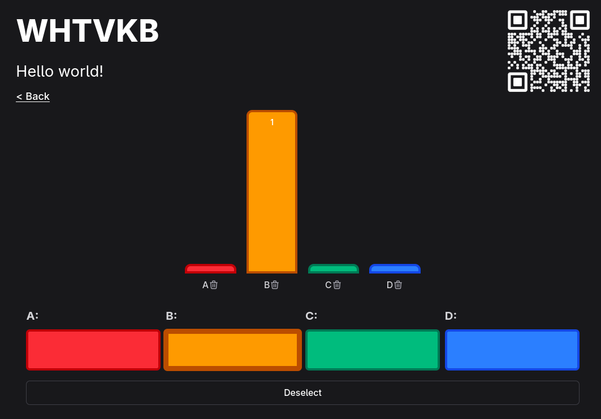

<p align="center">

</p>
<h3 align="center">Simple live polls for large audiences</h3>

Clicky is a simple tool to poll large groups of people and display results live. A presenter can create a room, define a list of options, and have an audience join via a QR code on screen.

_This applicatcion is built with Ktor and HTMX, with updates sent live using Server Sent Events. See the [Development](#development) section for more information._

## Screenshots

<p align="center">

</p>

## Self-hosting

Clicky runs as a single JVM process, with rooms stored in memory. Restarting the app will kick users back to the homepage, but the upside is no database or filesystem setup is needed at all! We provide a Docker image for easy setup, a full list of environment variables with descriptions can be found in [application.yaml](https://github.com/0ffz/Clicky/blob/master/server/src/main/resources/application.yaml)

```yaml
services:
  clicky:
    image: ghcr.io/0ffz/clicky:latest
    ports:
      - "8080:8080"
    environment:
      # Root URL of the site, used for QR codes
      SITE_URL: "https://example.com"
      # SITE_CHART_UPDATE_INTERVAL: 0.2
      # SITE_RATE_LIMIT: 100
      # SITE_INACTIVE_ROOM_TIMEOUT: 24
```

To get HTTPS encryption on your website, use a reverse proxy such as traefik, caddy, or nginx.

# Development

Build commands:

- Run local server: `./gradlew run`
- Build Docker image: `./gradlew publishImageToLocalRegistry`

## Architecture
_This app was originally an experiment rewriting an old [Django](https://github.com/0ffz/Clicky-django) application I made using HTMX, I will try to link to a blog post here once finished._ Below is a quick overview of the app architecture:

- Ktor serves pages using the Kotlin HTML DSL. They include HTMX as a small JavaScript dependency and style components using Tailwind classes (with the stylesheet generated by a small Gradle plugin.)
- We add HTMX tags to set up a Server Sent Event (SSE) connection. When state changes, the server renders partials using the HTML DSL which contain `id` tags that tell HTMX which components to swap.
- State for each room is stored in a ViewModel-like class, votes are cast by updating `MutableStateFlow` objects. This class also exposes flows for the rendered components using Molecule to listen to state changes using Compose.
  - NOTE: This logic doesn't really belong in a ViewModel, but we want to avoid re-rending the same components for each client, so we instead keep one flow and collect it in our `Ktor` route. It would be interesting to expand on this concept by providing an API to merge our Molecule composables with initial page generation so we could almost get the same experience as a normal compose app :thinking:.

## Architecture references

- [Ktor SSE docs](https://ktor.io/docs/server-server-sent-events.html) for using SSE on the backend.
- [HTMX SSE docs](https://htmx.org/extensions/sse/) for establishing a connection on the client.
- [Molecule](https://github.com/cashapp/molecule) aids in collecting state flows on the backend and rendering component updates on state changes.
- [Kotlinx.collections.immutable](https://github.com/Kotlin/kotlinx.collections.immutable/) lets us update large maps and lists efficiently, while keeping the simple `.update` syntax of MutableStateFlows.
- [TailwindCSS](https://tailwindcss.com/) is used via its CLI + a gradle task _(nag Offz about publishing this plugin if you're interested in using it)_.
- [Lucide icons](https://lucide.dev/icons/), which are inserted as SVGs.
- [HTMX + SSE post by anderssv](https://blog.f12.no/wp/2024/11/11/htmx-sse-easy-updates-of-html-state-with-no-javascript) for inspiring the partial function used and showing off a similar architecture.